# DeepSeek GUI 使用说明

## 1. 首次使用 — 获取模型 API

在设置 → 模型配置中填写配置名称、API Key 和 Base URL 等信息。

### OpenAI

- **Base URL**：`https://api.openai.com/v1`
- **Chat Completions**：`/chat/completions`（完整地址：`https://api.openai.com/v1/chat/completions`）

### DeepSeek

- **OpenAI 兼容 Base URL**：`https://api.deepseek.com`
- **Anthropic 兼容 Base URL**：`https://api.deepseek.com/anthropic`

### Anthropic (Claude)

- **Base URL**：`https://api.anthropic.com`
- **Messages API**：`/v1/messages`（完整地址：`https://api.anthropic.com/v1/messages`）

> 详情见《主流 LLM 模型的 API Base URL 汇总》。

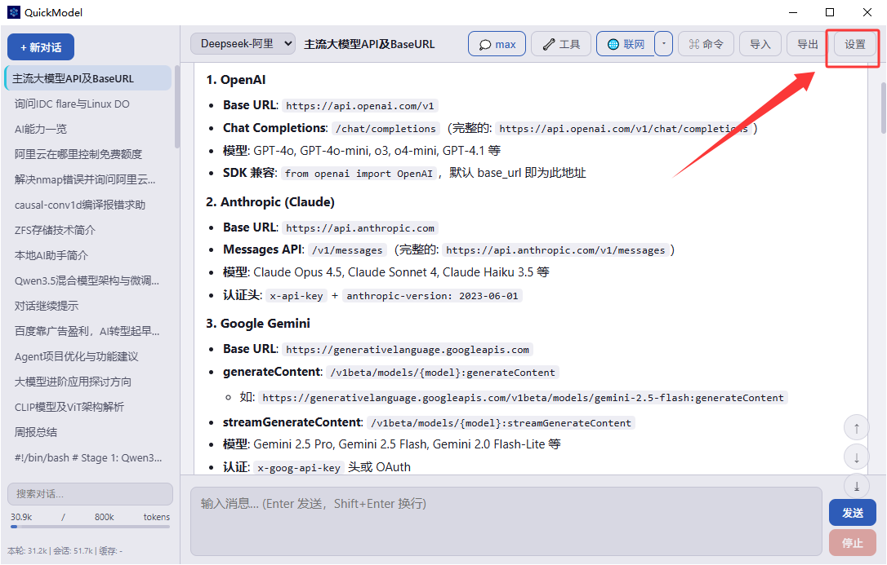

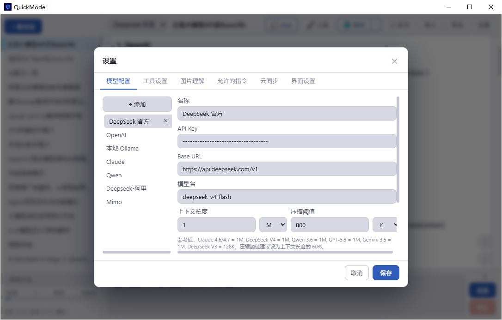

> 如果你只需要一个能在本地执行的 LLM 程序，配置到这里就可以使用了。
>
> 如果需要网络搜索、多端云同步等功能，请继续往下阅读。

## 2. 工具设置（可选）

这里配置的是联网搜索引擎，支持 Tavily、Brave 等。如果不想额外配置，本软件也提供了 DuckDuckGo 作为保底方案。

如需使用 Tavily、Brave 等功能更强大的搜索 MCP 工具，软件内已提供快捷跳转链接。下面以 Tavily 为例：

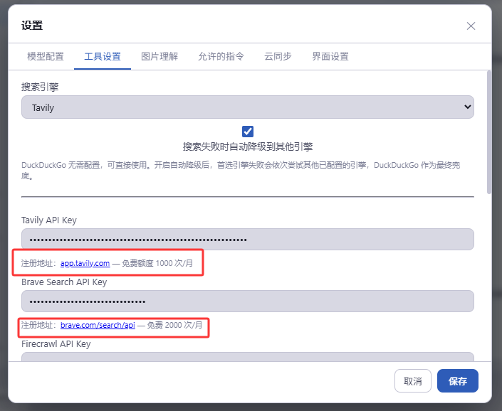

登录 Tavily 后新建 API Key，将其复制到软件中即可使用：

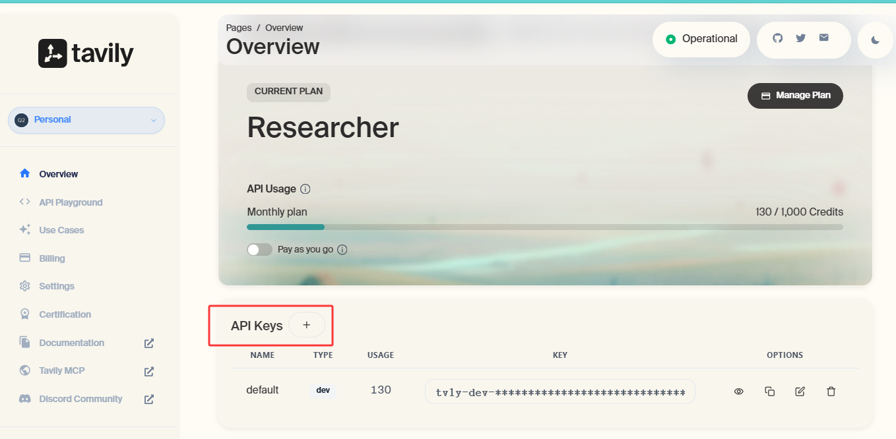

## 3. 图片理解（可选）

由于 DeepSeek 没有官方的图片理解模型，需要用户手动填入 VLM（视觉语言模型）的 API Key 和 Base URL，配置方式与步骤 1 相同。下面以阿里云的通义千问模型为例：

1. 登录阿里云百炼控制台：https://bailian.console.aliyun.com/

   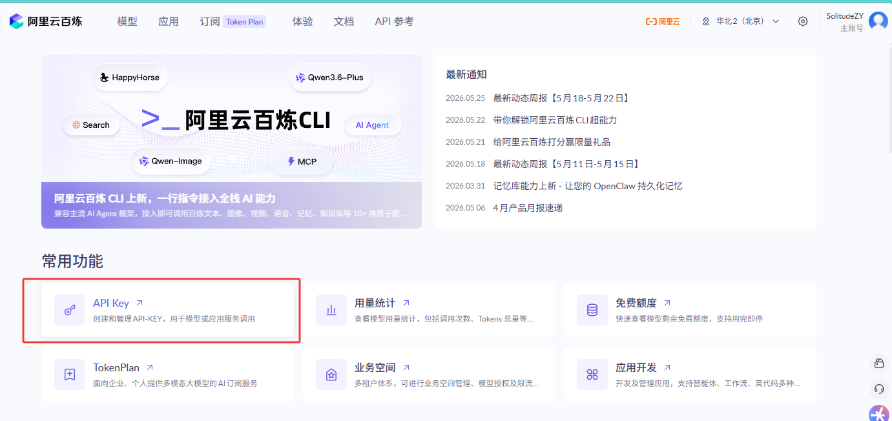
2. 找到「API-KEY」入口，创建一个新的 API Key：

   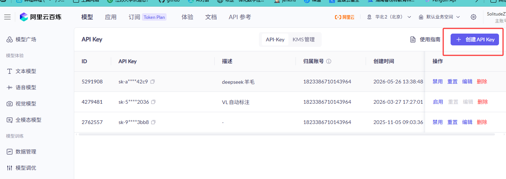
3. 创建完成后复制该 Key（以 `sk-` 开头的一串字符），粘贴到软件中。模型名称可使用 `qwen-vl-max`、`qwen3.5`、`qwen3.6-plus` 等视觉模型，具体型号请参考阿里云模型列表：

   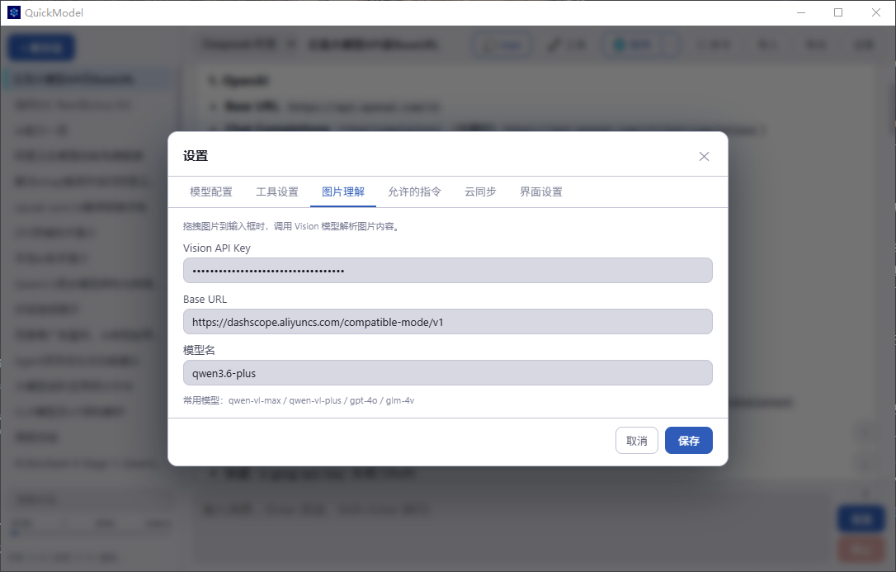
4. 附：模型列表

   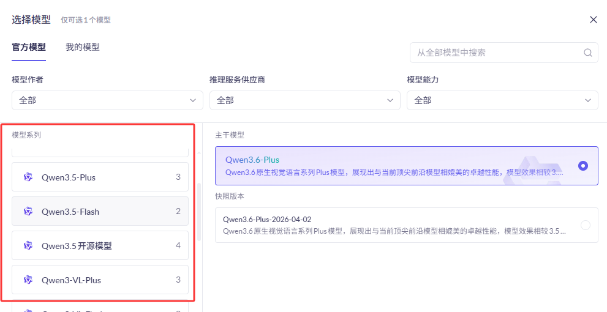

## 4. 指令自动执行

本软件支持指令自动执行，包括「5 秒自动确认」和「不确认直接执行」两种模式。入口位于设置 → 工具设置 → 命令执行安全（在联网搜索下方）。

开启自动执行可以解放双手，无需每次弹窗确认。但自动执行缺乏人工监管，模型自动执行的结果请自负责任。

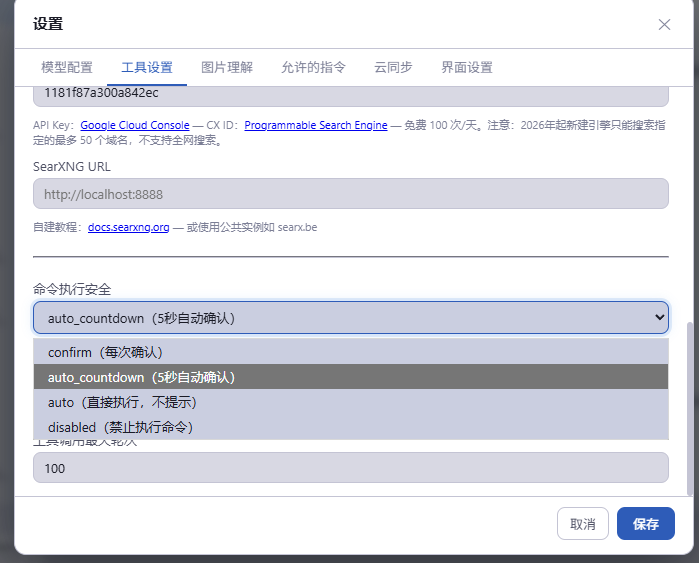


此外，用户还可以在此处设置命令超时时间和工具调用最大轮次（主要用于控制网页搜索，避免过快耗尽免费额度）。

同时，软件内部对 web search（网页搜索）设有 5 次的软限制。达到限制后，系统会以提示词注入的方式引导模型停止搜索，改为直接回复。如需调整软限制次数，请修改源码。

## 5. 云同步


在设置 → 云同步功能中，本软件支持通过坚果云等云服务平台实现多端同步。只需下载坚果云并填写同步文件夹地址，点击「一键上传」即可将对话历史、模型配置等内容上传至云端。

## 6. 多模型协作与用户交互

本软件内置了丰富的人机协作与多模型协同机制，帮助你在复杂任务中获得更可靠的执行体验。

### Subagent（子代理）

当遇到独立且复杂的子任务时，模型可以派遣一个专注的子代理（Subagent）来并行处理。子代理分为两种类型：只读型（Explore）仅能分析搜索，适合代码审查、信息检索；读写型（General）可以修改文件，适合代码重构、批量操作等。子代理完成工作后会将结果摘要返回给主模型，主模型再据此继续推进任务。

这一机制尤其适合以下场景：需要同时分析多个文件、项目中跨目录搜索特定模式、或让多个子任务并行执行以节省时间。

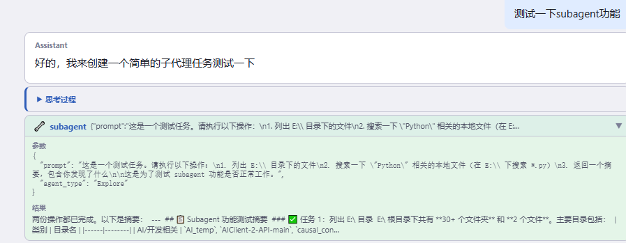

### Todo 列表

当用户提出需要多步骤才能完成的任务时，模型会自动调用 `todo_write` 工具生成一份结构化待办清单，并按「待处理 → 进行中 → 已完成」的状态逐步推进。你可以在对话过程中随时看到当前任务的执行进度，每个步骤完成时状态都会实时更新。

这样设计的目的是确保复杂任务不会被遗漏任何环节，也让用户对模型的执行路径一目了然。

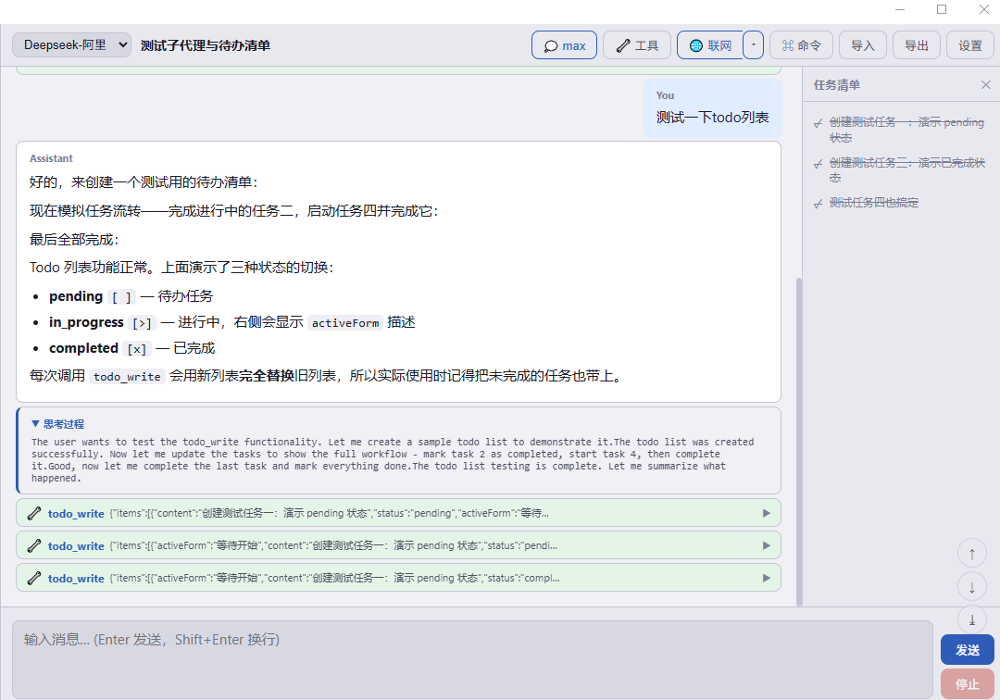

### 计划模式（Plan Mode）

在进行新功能开发、架构调整、多文件变更或任何需要权衡方案的任务之前，模型会进入计划模式。在计划模式下，模型会先输出完整、可执行的详细方案，然后通过交互式提问逐步与用户确认每个关键决策点，直到方案完全敲定后才退出计划模式、开始动手执行。

这种「先规划、再确认、后执行」的流程大幅降低了返工概率，也让你对模型的行为始终保持掌控。

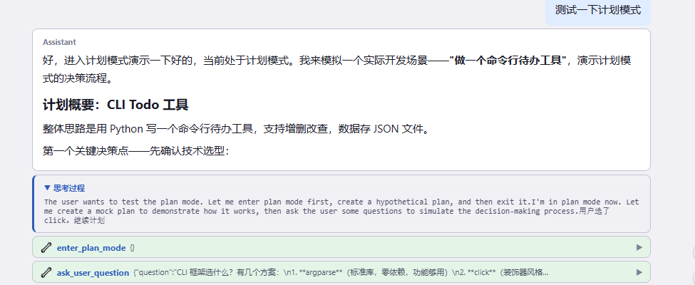

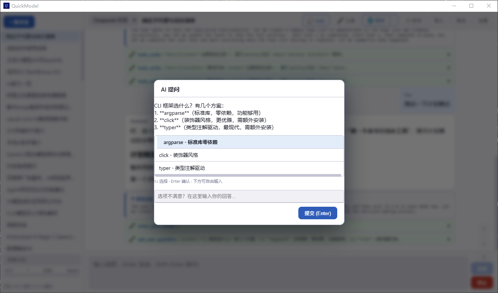

### 向用户提问（Ask User Question）

当模型在执行过程中遇到不确定因素——比如有多种可行方案、关键信息缺失、或需要你做出偏好选择时——会主动暂停并弹出提问卡片。你可以从预设选项中选择，也可以自由输入回答。模型收到你的回复后会立即继续执行，而不会盲目猜测你的意图。

支持单选和多选两种模式，确保交互高效且精准。

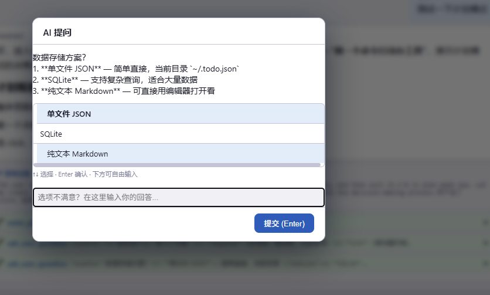

### 持久化任务（Task）

对于跨对话的长期工作，模型可以通过 `task_create` 创建持久化任务，将当前进度、上下文和待办事项保存下来。下次对话中可以通过任务 ID 恢复继续，不必从头开始。你可以在任意时刻查看所有活跃任务的进度和依赖关系。

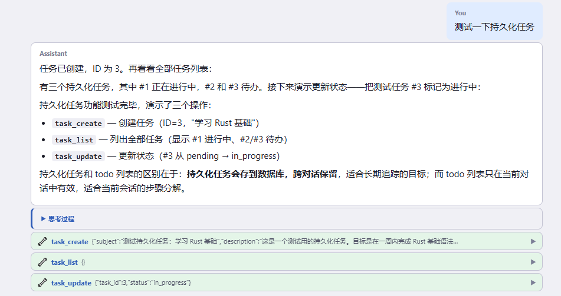

## 7. 其他功能

### 模型配置相关

在模型配置界面中，用户可以使用我们提供的系统提示词，告知 LLM 其拥有的工具列表和 Skill 列表（是的，本软件支持 Skill 功能）：

```text
你是一个强大的 AI 助手，运行在配备完整工具集的桌面环境中。

## 工作原则

- 优先动手解决问题，而不是只给建议。能用工具完成的任务，直接执行。
- 遇到需要多步骤的任务，先用 todo_write 列出计划，再逐步执行，完成后更新状态。
- 不确定文件内容或目录结构时，先用 read_file / list_directory 查看，不要凭假设回答。
- 需要最新信息时，主动使用 web_search，搜到摘要不够详细时用 web_read 读取完整页面。
- 执行命令前说明意图，执行后汇报结果。
- 修改文件后要明确指出修改的位置（如"第 12–15 行"），写入文件后要明确指出文件所在路径（如"E:\Python_Prj\文件名"）。
- 写入的文件如果没有上下文指定保存路径，则默认保存在 "E:\AI_temp"，不要把生成的文件放在桌面。

## 回答风格

- 用中文回答，代码和专有名词保持原文。
- 技术解释用段落叙述，不要过度分点。
- 回答简洁直接，不重复用户说过的话，不加无意义的开场白。
- 代码给出完整可运行的版本，不省略关键部分。

## 能力边界

你可以读写本地文件、执行 PowerShell 命令、搜索互联网、分析图片。
对于复杂的长期任务，可以使用 task_create 创建持久化任务跨对话追踪进度。
```

此外，用户可自行设置模型的上下文长度和压缩阈值。软件会自动检测当前对话的上下文使用量，你可以在左下角的进度条看到当前 Token 数量，达到压缩阈值后将自动触发压缩（压缩功能待测试）。


### 允许的指令

本软件内置指令白名单功能（目前主要针对 PowerShell 指令），允许模型通过正则匹配查询所有已被允许的指令。当调用的指令匹配白名单时，系统将跳过确认直接执行。

白名单支持自动添加：当模型连续三次调用同一条指令后，系统会询问用户是否将该指令（正则匹配）加入白名单，示例如下：

```text
Get-Content *
Get-Process *
Start-Sleep *
Select-String *
```

### 界面设置

本软件支持浅色和深色主题切换。

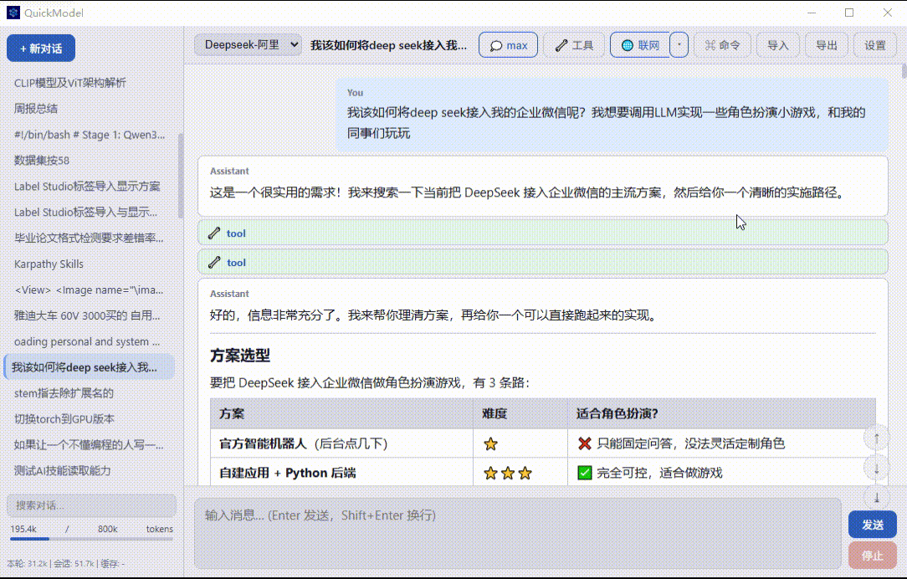

### Skill 功能

本软件支持一键添加 SKILL.md。


> 你可以在对话中直接询问模型「你有哪些工具和 Skill」，模型会列出清单。通过这种方式可以确认 Skill 是否已成功添加。

### 联网模式开关


支持手动控制或自动搜索两种模式。

### 工具调用栏隐藏

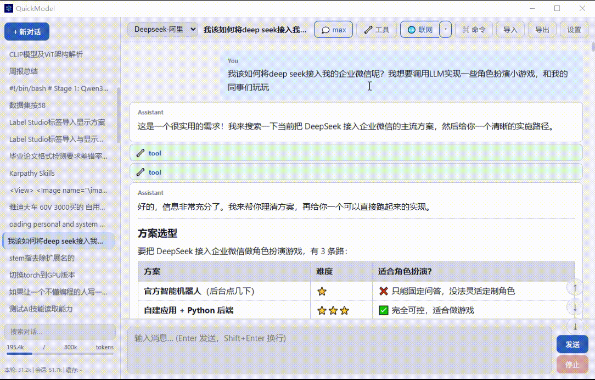

### Memory 记忆功能

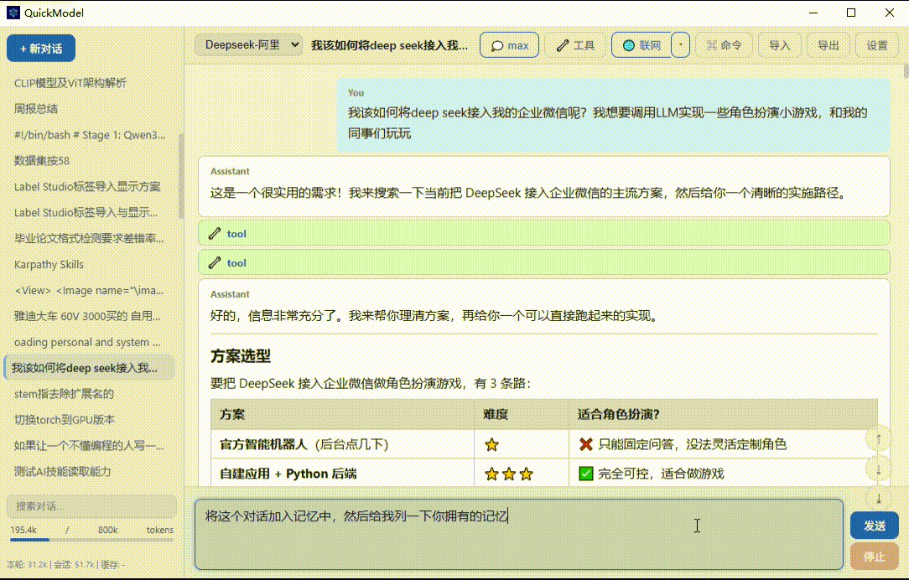

本软件提供了持久化记忆功能，用于跨会话保存对话内容。

支持直接复制粘贴文件到对话栏目中

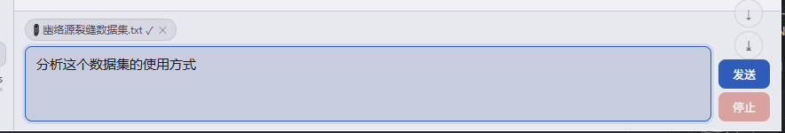
